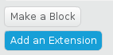
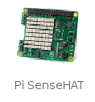
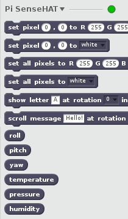
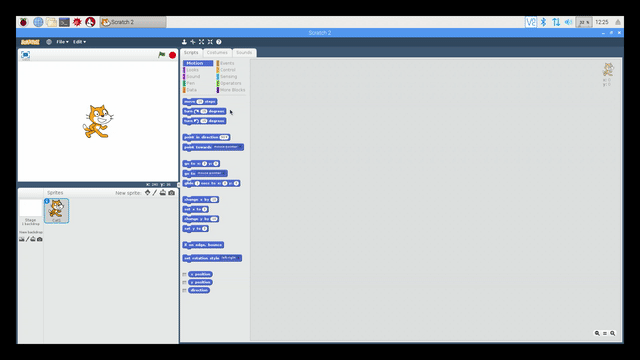

So you can control and read input and output components connected to the Raspberry Pi's GPIO pins using Scratch 2, you need to enable the Pi GPIO extension.

- With Scratch 2 open, click on **More Blocks** in the Scripts menu.

	

- Next, click on the **Add an Extension** button.

	
	
- Then double-click on the **Pi SenseHAT** extension to add it.

	
	
- You should now see the **Pi SenseHAT** blocks in the **More Blocks** section.

	

	

